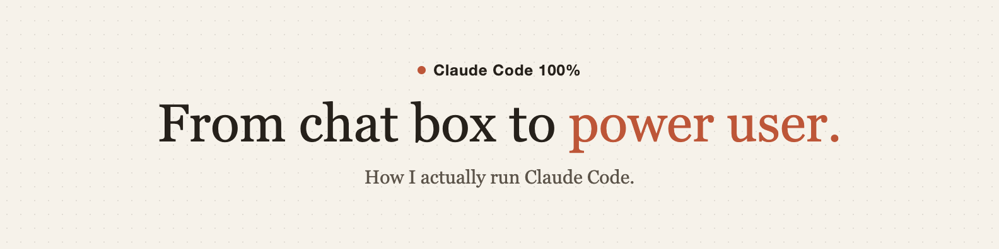

Founding engineer at a startup in Kraków. I run coding agents all day and I haven't written a line of code by hand in months. Full stack, end to end: Next.js, Django, Postgres, AWS.

I write **[Ship Today](https://shiptoday.substack.com/)**, practical lessons on shipping faster as an AI-native engineer: 10,000 hours in Claude Code, 100+ custom skills, and what actually survives contact with production.

- 1st place at HackYeah 2025, Europe's biggest hackathon
- 1st place at HackNation 2025
- Co-leader of BRAVE AI Community Cracow

## Projects shipped

Every public ship gets a post. The repo is the proof, the post is the lesson.

- **[ccusage-dashboard](https://github.com/Pawel-Kica/ccusage-dashboard)** - local browser dashboard for your Claude Code usage. Built and shipped in one evening ([the post](https://shiptoday.substack.com/p/i-shipped-my-first-public-project)).
- **[claude-simple-memory](https://github.com/Pawel-Kica/claude-simple-memory)** - Claude Code's memory replaced with markdown you own: one file per fact, a one-line index in CLAUDE.md. Clone it, run one prompt, done.

More on the way.

## The Weekend Session

4 hours, live, on your machine: my whole agentic setup installed and one real thing shipped before we hang up. Details at **[pawelkica.com](https://pawelkica.com)**.

## Reach me

[Ship Today](https://shiptoday.substack.com/) · [LinkedIn](https://www.linkedin.com/in/pawel-kica/) · [pawel.kica.cc@gmail.com](mailto:pawel.kica.cc@gmail.com)
